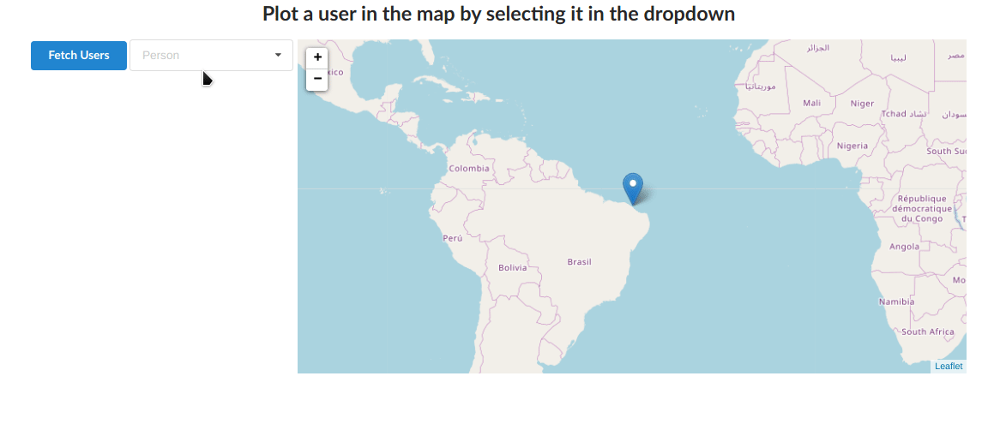

# Minimap Project

This is a simple project that uses [leaflet](https://github.com/Leaflet/Leaflet) to render a map with many functionalities.
The project comunicates with a simple server that uses the library [json-server](https://github.com/typicode/json-server).

a sample of the app being used

